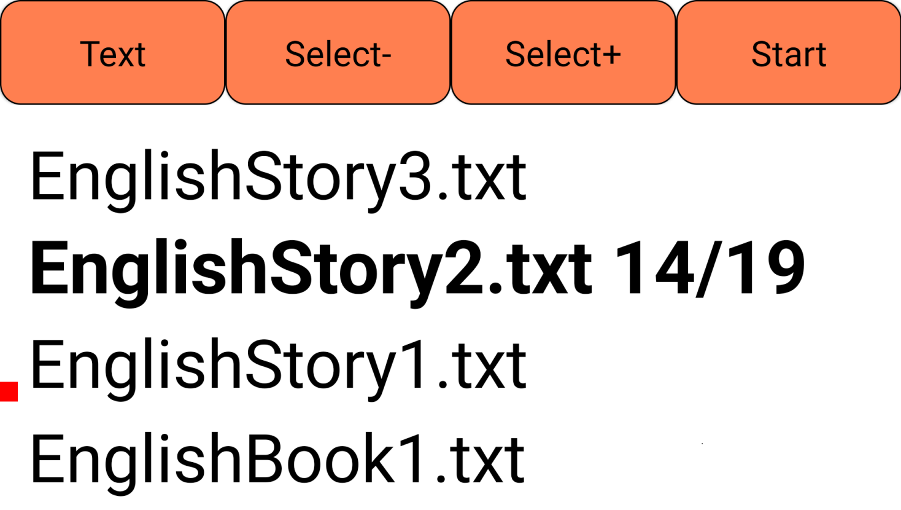
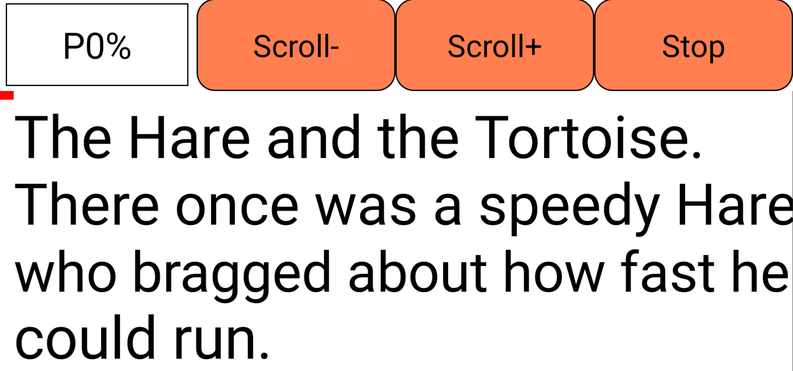

# EasyReader
EasyReader is a free Android app for blind people and people with visual impairment.

## Possibilities are:
Four intuitively placed large format buttons allow the user to perform all the following actions:
- Choose a file from the list of files. The files can be text files, but also images with text in them.
- Start the file. Listen to the file or read it with a large or very large font.
- Adjust the playback speed while listening or reading.
- Pause.
- Scroll up or down in the file during pause.
- Stop the current file.
- Start the Android camera and listen to or read the text in an image. 
  The image is converted to text by means of optical character recognition (OCR)
- Delete a file.
- For blind users, the one-time configuration must be done by a third person.

## Code
- Click on the green 'Code' button.
- Download EasyReader.zip
- Extract EasyReader.zip
- Open the code with B4A.  B4A is a part of B4X.
- B4A is available at https://B4X.com

## Manual
The manual is in the link:
https://www.ganseman.com/Manuals/EasyReader.pdf

